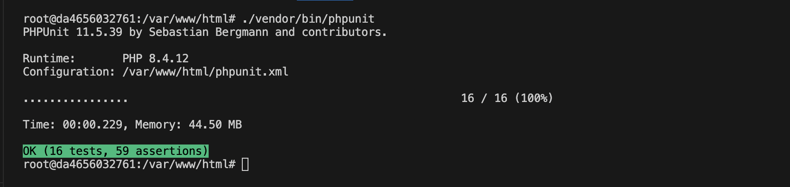

# News Aggregator App

The **News Aggregator App** is a Laravel-based API that fetches and aggregates news articles from multiple providers.

---

## Prerequisites

You will need to have **Docker** and **Docker Compose** installed on your system.  
Follow the instructions at: [https://docs.docker.com/get-docker/](https://docs.docker.com/get-docker/).

---

## Installation


1. Clone project directory
    ```python
    #clone the repo in your work directory
    git clone git@github.com:anaskm/news-aggregator.git

    #open project directory
    cd news-aggregator
    ```

2. Create .env file by duplicating .env.example
    ```python

    #Copy env file if not exist already
    cp .env.example .env

    #Set API credential values for news providers
    NEWSORG_API_URL="https://newsapi.org/v2/everything"
    NEWSORG_API_KEY=

    NYT_API_URL="https://api.nytimes.com/svc/search/v2/articlesearch.json"
    NYT_API_KEY=

    GUARDIAN_API_URL="https://content.guardianapis.com/search"
    GUARDIAN_API_KEY=

    NEWSAPI_API_URL="https://eventregistry.org/api/v1/article/getArticlesForTopicPage"
    NEWSAPI_API_URL_ID=
    NEWSAPI_API_KEY=
    ```

3. Setup docker & containers
    ```python
    #build docker containers
    docker compose up -d --build

    ```

4. Generate JWT keys (required for authentication)
    ```bash
    docker exec -it news_app php artisan auth:generate-jwt
    ```

5. Populate articles from news providers
    ```bash
    docker exec -it news_app php artisan news:fetch
    ```

## Tests
All tests passing:


## Usage

  -  **Postman Collection**  
    A ready-to-use Postman collection is included in the repository:  
    [News Aggregator Collection](docs/postman/News%20Aggregator.postman_collection.json)

  - **Swagger UI**  
    Interactive API documentation is also available via **Swagger**.  
    Once the application is running, you can open Swagger UI in your browser at: 
    
    [http://newsapp.localhost/api/documentation](http://newsapp.localhost/api/documentation)
